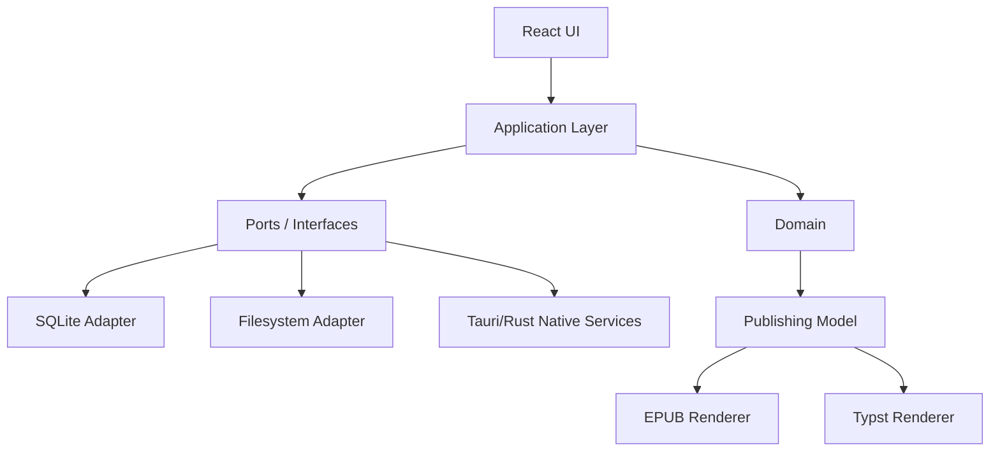

# 03 — Arquitetura

## Estilo

**Modular Monolith**, com fronteiras explícitas e dependências controladas.

Não usar microserviços. Não colocar lógica editorial em componentes React. Não usar Rust para tudo apenas por estar disponível.

## Camadas



## Módulos

### `domain`
Sem React, Tauri, SQLite ou filesystem.

Contém:
- Project;
- Document;
- FlowDocument;
- estrutura do livro;
- metadata;
- rights/copyright;
- estilos semânticos;
- invariantes;
- IDs;
- domain events quando úteis.

### `editor-core`
Responsável pela integração semântica com ProseMirror/Tiptap.

Contém:
- schema;
- extensions próprias;
- conversão EditorState <-> domínio persistível;
- comandos;
- normalização;
- sanitização;
- regras de paste;
- versionamento do schema de conteúdo.

### `application`
Casos de uso/orquestração:
- CreateProject;
- OpenProject;
- CreateDocument;
- MoveDocument;
- UpdateMetadata;
- SaveDocument;
- ExportBook;
- RestoreSnapshot.

### `project-format`
- formato físico do projeto;
- manifest;
- migrations;
- checksums quando necessário;
- empacotamento/desempacotamento.

### `publishing`
Cria uma representação intermediária independente da UI.

```text
Domain -> Publishing IR -> Layout/Renderer -> Artifact
```

### `desktop`
React + Tauri, menus, janelas, clipboard, file picker, OS integration.

## Dependências permitidas

```text
ui -> application -> domain
editor-ui -> editor-core -> domain
persistence-adapters -> domain interfaces
publishing -> domain
Tauri commands -> application
```

Dependências proibidas:

```text
domain -> React
 domain -> Tauri
 domain -> SQLite
 publishing -> DOM da UI
 editor-core -> componentes React
```

## IPC Tauri

Usar comandos Tauri para operações nativas, não como API de granularidade excessiva.

Bom:
- `open_project(path)`
- `select_export_destination()`
- `export_project(project_id, profile_id)`
- `reveal_in_file_manager(path)`

Evitar:
- `save_character(char)` a cada tecla;
- centenas de chamadas IPC para estado puramente visual.

## IDs

Preferir UUIDv7/ULID para entidades persistidas por ordenação temporal e independência de banco.

Nunca usar nome/título como chave estável.

## Commands e mutations

Toda operação estrutural deve ser modelada como comando explícito.

Exemplo:

```ts
type MoveDocumentCommand = {
  documentId: DocumentId;
  newParentId: DocumentId | null;
  position: number;
};
```

Isso facilita validação, undo estrutural, logs e testes.

## Eventos

Eventos internos só onde reduzem acoplamento. Não criar event bus global para tudo.

Exemplos úteis:
- `ProjectOpened`;
- `DocumentMoved`;
- `AssetDeleted`;
- `ProjectMigrated`;
- `ExportCompleted`.

## Feature flags

Usar para funcionalidades incompletas que já tenham infraestrutura no código, especialmente:
- CanvasDocument;
- DOCX;
- custom themes;
- experimental pagination.

Flags não substituem branches nem testes.
